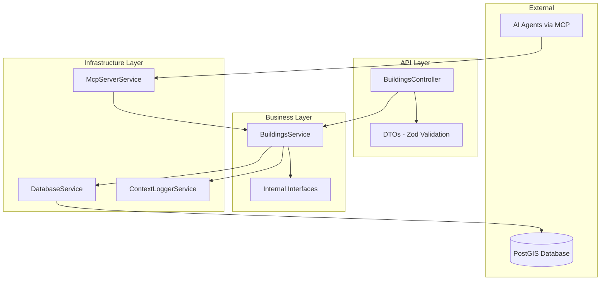

# Design Document: Buildings API

## Overview

The Buildings API is a NestJS-based REST API service that provides comprehensive access to building data stored in a PostGIS database. The system follows the Mindicity API architecture patterns with strict separation between controllers (DTOs), services (interfaces), and infrastructure layers. The API supports efficient querying through pagination, text-based filtering, and geospatial polygon filtering, while providing MCP tools for programmatic access by AI agents.

The system will be bootstrapped from the official Mindicity template repository and implement the buildings module within the established infrastructure framework.

## Architecture

### Technology Stack

- **Framework**: Node.js + NestJS + Fastify
- **Database**: PostgreSQL with PostGIS extensions
- **Logging**: Pino with ContextLoggerService
- **Validation**: Zod schemas for DTOs
- **Testing**: Jest with property-based testing
- **Documentation**: Swagger/OpenAPI
- **MCP Integration**: HTTP transport for AI agent connectivity

### System Architecture



### Module Structure

Following Mindicity patterns, the buildings module will be organized as:

```
src/modules/buildings/
├── buildings.module.ts          # NestJS module configuration
├── buildings.controller.ts      # HTTP endpoints (DTOs only)
├── buildings.service.ts         # Business logic (interfaces only)
├── dto/                         # Request/Response DTOs (Zod validation)
│   ├── query-buildings.dto.ts
│   ├── building-response.dto.ts
│   └── pagination.dto.ts
├── interfaces/                  # Internal service interfaces
│   ├── building-data.interface.ts
│   ├── building-query.interface.ts
│   └── pagination.interface.ts
├── mcp/                         # MCP tools for AI agents
│   ├── buildings-mcp-http.tool.ts
│   ├── buildings-mcp-http.tool.spec.ts
│   └── index.ts
└── test/                        # E2E tests
    └── buildings.e2e-spec.ts
```

## Components and Interfaces

### Controller Layer (DTOs)

**BuildingsController**: Handles HTTP requests using DTOs for validation and response formatting.

```typescript
@ApiTags('buildings')
@ApiBearerAuth() // Swagger docs only - gateway handles auth
@Controller(ROUTES.BUILDINGS)
export class BuildingsController {
  constructor(
    private readonly buildingsService: BuildingsService,
    private readonly logger: ContextLoggerService,
  ) {
    this.logger.setContext(BuildingsController.name);
  }

  @Get()
  @ApiOperation({ summary: 'Get buildings with filtering and pagination' })
  async findAll(@Query() query: QueryBuildingsDto): Promise<BuildingResponseDto[]>

  @Get('geospatial')
  @ApiOperation({ summary: 'Get buildings within polygon area' })
  async findByPolygon(@Query() query: GeospatialQueryDto): Promise<BuildingResponseDto[]>
}
```

**Key DTOs**:
- `QueryBuildingsDto`: Pagination and text filtering parameters
- `GeospatialQueryDto`: Polygon-based spatial filtering
- `BuildingResponseDto`: Standardized building data response
- `PaginationMetaDto`: Pagination metadata response

### Service Layer (Interfaces)

**BuildingsService**: Contains business logic and coordinates database operations using internal interfaces.

```typescript
@Injectable()
export class BuildingsService {
  private readonly logger: ContextLoggerService;

  constructor(
    loggerService: ContextLoggerService,
    private readonly databaseService: DatabaseService,
  ) {
    this.logger = loggerService.child({ serviceContext: BuildingsService.name });
  }

  async findAll(query: BuildingQuery): Promise<BuildingData[]>
  async findByPolygon(query: GeospatialQuery): Promise<BuildingData[]>
  async countTotal(query: BuildingQuery): Promise<number>
}
```

**Key Interfaces**:
- `BuildingData`: Internal building data structure
- `BuildingQuery`: Text filtering and pagination parameters
- `GeospatialQuery`: Spatial filtering parameters
- `PaginationOptions`: Pagination configuration

### Database Integration

The service will use SqlQueryBuilder for standard queries and raw SQL only for complex PostGIS operations:

```typescript
// Standard queries with SqlQueryBuilder
const { query: sql, params } = SqlQueryBuilder
  .create()
  .select(['id', 'cadastral_code', 'municipality_code', 'name', 'building_type', 'address', 'ST_AsGeoJSON(geom) as geom', 'basic_data', 'visible', 'created_at', 'updated_at', 'updated_by'])
  .from('public.buildings')
  .where('visible = $1', [true])
  .orderBy('created_at', 'DESC')
  .limit(query.limit ?? 20)
  .offset(query.offset ?? 0)
  .build();

// Complex PostGIS queries with raw SQL
const spatialSql = `
  SELECT id, cadastral_code, municipality_code, name, building_type, address,
         ST_AsGeoJSON(geom) as geom, basic_data, visible, created_at, updated_at, updated_by
  FROM public.buildings 
  WHERE visible = true 
    AND ST_Intersects(geom, ST_GeomFromText($1, 4326))
  ORDER BY created_at DESC
  LIMIT $2 OFFSET $3
`;
```

### MCP Integration

Following Mindicity patterns, the system will implement MCP tools for HTTP transport:

**MCP Tools**:
- `get_buildings_list`: Basic building search with text filtering
- `search_buildings_geospatial`: Geospatial polygon-based search
- `get_building_by_id`: Individual building retrieval
- `get_buildings_count`: Total count for pagination

**Tool Implementation Pattern**:
```typescript
export class BuildingsMcpHttpTool {
  constructor(private readonly buildingsService: BuildingsService) {}

  get_buildings_list(args: Record<string, unknown>): CallToolResult {
    const data = this.buildingsService.findAll(args as BuildingQuery);
    return {
      content: [{ type: 'text', text: JSON.stringify(data, null, 2) }],
    };
  }

  static getToolDefinitions(): Array<ToolDefinition> {
    return [
      {
        name: 'get_buildings_list',
        description: `Retrieve buildings with comprehensive filtering and pagination support.
        
        This tool provides access to building data including:
        - Building identification (id, cadastral_code, municipality_code)
        - Property information (name, building_type, address)
        - Geospatial data (geometry in GeoJSON format)
        - Metadata (basic_data JSONB, timestamps, visibility)
        
        Supports text-based filtering on all string columns and pagination for large datasets.`,
        inputSchema: {
          type: 'object',
          properties: {
            name: { type: 'string', description: 'Filter by building name (partial match)' },
            building_type: { type: 'string', description: 'Filter by building type' },
            address: { type: 'string', description: 'Filter by address (partial match)' },
            cadastral_code: { type: 'string', description: 'Filter by cadastral code' },
            municipality_code: { type: 'string', description: 'Filter by municipality code' },
            limit: { type: 'number', minimum: 1, maximum: 100, description: 'Number of results to return' },
            offset: { type: 'number', minimum: 0, description: 'Number of results to skip' }
          },
          required: [],
        },
        usage: {
          purpose: 'Retrieve and filter building data via HTTP transport',
          when_to_use: [
            'When searching for buildings by property characteristics',
            'For building management and administrative tasks',
            'During data analysis and reporting workflows',
            'To verify building existence before other operations',
          ],
          response_format: 'Array of building objects with complete property and geospatial data',
          interpretation: {
            visible: 'true = building is active and visible, false = hidden/archived',
            geom: 'GeoJSON Point geometry in WGS84 (EPSG:4326) coordinate system',
            basic_data: 'JSONB object containing additional building metadata',
            created_at: 'Building record creation timestamp in ISO 8601 format',
          },
          examples: [
            {
              scenario: 'Search residential buildings in specific municipality',
              expected_result: 'List of buildings with building_type matching criteria and municipality_code filter',
            },
            {
              scenario: 'Paginated building list for administrative interface',
              expected_result: 'Limited number of buildings based on limit/offset parameters with metadata',
            },
          ],
        },
      },
    ];
  }
}
```

## Data Models

### Database Schema

The system interfaces with the existing `public.buildings` table:

```sql
CREATE TABLE public.buildings (
  id VARCHAR NOT NULL,
  cadastral_code TEXT NOT NULL,
  municipality_code TEXT NOT NULL,
  name TEXT NULL,
  building_type TEXT NOT NULL,
  address TEXT NOT NULL,
  geom public.geometry(POINT, 4326) NULL,
  basic_data JSONB DEFAULT '{}'::jsonb NOT NULL,
  visible BOOLEAN DEFAULT true NULL,
  created_at TIMESTAMP DEFAULT now() NOT NULL,
  updated_at TIMESTAMP DEFAULT now() NULL,
  updated_by TEXT NULL
);
```

### Internal Data Interfaces

```typescript
interface BuildingData {
  id: string;
  cadastral_code: string;
  municipality_code: string;
  name: string | null;
  building_type: string;
  address: string;
  geom: GeoJSON.Point | null;
  basic_data: Record<string, unknown>;
  visible: boolean;
  created_at: Date;
  updated_at: Date | null;
  updated_by: string | null;
}

interface BuildingQuery {
  name?: string;
  building_type?: string;
  address?: string;
  cadastral_code?: string;
  municipality_code?: string;
  limit?: number;
  offset?: number;
}

interface GeospatialQuery extends BuildingQuery {
  polygon: string; // WKT format polygon
}

interface PaginationMeta {
  total: number;
  limit: number;
  offset: number;
  hasNext: boolean;
  hasPrevious: boolean;
}
```

### DTO Schemas (Zod Validation)

```typescript
const QueryBuildingsSchema = z.object({
  name: z.string().optional(),
  building_type: z.string().optional(),
  address: z.string().optional(),
  cadastral_code: z.string().optional(),
  municipality_code: z.string().optional(),
  limit: z.coerce.number().int().min(1).max(100).default(20),
  offset: z.coerce.number().int().min(0).default(0),
});

const GeospatialQuerySchema = QueryBuildingsSchema.extend({
  polygon: z.string().regex(/^POLYGON\(\(.*\)\)$/, 'Invalid WKT polygon format'),
});

const BuildingResponseSchema = z.object({
  id: z.string(),
  cadastral_code: z.string(),
  municipality_code: z.string(),
  name: z.string().nullable(),
  building_type: z.string(),
  address: z.string(),
  geom: z.object({
    type: z.literal('Point'),
    coordinates: z.array(z.number()).length(2),
  }).nullable(),
  basic_data: z.record(z.unknown()),
  visible: z.boolean(),
  created_at: z.string().datetime(),
  updated_at: z.string().datetime().nullable(),
  updated_by: z.string().nullable(),
});
```

Now I need to use the prework tool to analyze the acceptance criteria before writing the correctness properties section.

<function_calls>
<invoke name="prework">
<parameter name="featureName">buildings-api

## Correctness Properties

*A property is a characteristic or behavior that should hold true across all valid executions of a system—essentially, a formal statement about what the system should do. Properties serve as the bridge between human-readable specifications and machine-verifiable correctness guarantees.*

Based on the prework analysis, the following properties have been identified to validate the system's correctness through property-based testing:

### Property 1: Complete Response Structure
*For any* valid building query, the API response should include all required fields (id, cadastral_code, municipality_code, name, building_type, address, geom, basic_data, visible, created_at, updated_at, updated_by) in valid JSON format with proper data types.
**Validates: Requirements 1.3, 1.5, 8.4**

### Property 2: Default Visibility Filtering
*For any* query without explicit visibility filters, all returned buildings should have visible = true.
**Validates: Requirements 1.4, 8.3**

### Property 3: Pagination Behavior
*For any* valid pagination parameters (limit, offset), the API should return exactly the specified number of results (up to the limit), skip the correct number of records (offset), and include accurate pagination metadata.
**Validates: Requirements 2.2, 2.3, 2.4**

### Property 4: Text Filtering Consistency
*For any* text filter parameter (name, building_type, address, cadastral_code, municipality_code), all returned buildings should match the specified criteria using appropriate matching logic (partial for name/address, exact for codes/types).
**Validates: Requirements 3.2, 3.3, 3.4, 3.5, 3.6**

### Property 5: Multiple Filter Combination
*For any* combination of multiple text filters, all returned buildings should satisfy ALL specified criteria (AND logic).
**Validates: Requirements 3.7**

### Property 6: Geospatial Intersection
*For any* valid WKT polygon and building dataset, all returned buildings should have geometry that intersects with the specified polygon.
**Validates: Requirements 4.2**

### Property 7: Combined Spatial and Text Filtering
*For any* combination of geospatial and text filters, all returned buildings should satisfy both the spatial intersection and text matching criteria.
**Validates: Requirements 4.5**

### Property 8: Input Validation Error Handling
*For any* invalid input parameters (malformed WKT, negative pagination values, invalid query parameters), the API should return appropriate 400 Bad Request responses with descriptive error messages.
**Validates: Requirements 4.4, 7.1, 7.4, 7.5**

### Property 9: Empty Result Handling
*For any* query that matches no buildings, the API should return an empty result set with 200 OK status and proper pagination metadata.
**Validates: Requirements 7.3**

### Property 10: MCP Tool Delegation
*For any* MCP tool call with valid parameters, the tool should correctly delegate to the corresponding service method and return properly formatted building data.
**Validates: Requirements 5.2, 5.4, 6.2**

### Property 11: MCP Parameter Support
*For any* supported search parameter in MCP tools, the tool should accept and process the parameter correctly, supporting all text fields and WKT polygon format for geospatial searches.
**Validates: Requirements 5.3, 6.3, 6.4, 6.5**

### Property 12: MCP Error Handling
*For any* error condition in the underlying service, MCP tools should handle the error gracefully and return meaningful error messages to the calling agent.
**Validates: Requirements 5.5**

## Error Handling

The system implements comprehensive error handling following NestJS and Mindicity patterns:

### Validation Errors (400 Bad Request)
- **Zod Schema Validation**: All DTOs use Zod schemas for automatic validation
- **WKT Format Validation**: Polygon parameters validated against WKT regex patterns
- **Pagination Validation**: Limit (1-100), offset (≥0) validation with descriptive messages
- **Parameter Type Validation**: Automatic coercion and validation of query parameters

### Database Errors (500 Internal Server Error)
- **Connection Failures**: Handled by DatabaseService with proper logging
- **Query Errors**: PostGIS-specific errors caught and logged with correlation IDs
- **Transaction Failures**: Automatic rollback with error reporting

### Business Logic Errors
- **No Results Found**: Returns empty array with 200 OK status
- **Invalid Spatial Queries**: Returns 400 with specific PostGIS error details
- **Pagination Overflow**: Returns empty results without error

### Error Response Format
```typescript
interface ErrorResponse {
  statusCode: number;
  message: string | string[];
  error: string;
  timestamp: string;
  path: string;
  correlationId: string;
}
```

### Logging Strategy
- **Infrastructure Errors**: Logged by DatabaseService with full context
- **Business Errors**: Logged by BuildingsService with correlation IDs
- **Validation Errors**: Logged by NestJS validation pipes
- **MCP Errors**: Logged by MCP tools with agent context

## Testing Strategy

The system implements a dual testing approach combining unit tests and property-based tests for comprehensive coverage:

### Property-Based Testing Configuration

**Framework**: Jest with `fast-check` library for property-based testing
**Minimum Iterations**: 100 iterations per property test
**Test Organization**: Each correctness property implemented as a separate property-based test

**Property Test Implementation Pattern**:
```typescript
describe('Buildings API Property Tests', () => {
  it('Property 1: Complete Response Structure', async () => {
    await fc.assert(
      fc.asyncProperty(
        fc.record({
          limit: fc.integer({ min: 1, max: 100 }),
          offset: fc.integer({ min: 0, max: 1000 }),
          name: fc.option(fc.string()),
        }),
        async (query) => {
          const response = await buildingsService.findAll(query);
          
          // Verify all required fields present
          response.forEach(building => {
            expect(building).toHaveProperty('id');
            expect(building).toHaveProperty('cadastral_code');
            expect(building).toHaveProperty('municipality_code');
            // ... all other required fields
          });
        }
      ),
      { numRuns: 100 }
    );
  });
  
  // **Feature: buildings-api, Property 1: Complete Response Structure**
});
```

### Unit Testing Strategy

**Coverage Target**: >80% code coverage
**Focus Areas**:
- **Controller Layer**: DTO validation, response formatting, error handling
- **Service Layer**: Business logic, query building, data transformation
- **MCP Tools**: Tool registration, parameter handling, response formatting

**Unit Test Categories**:
- **Happy Path Tests**: Standard operations with valid inputs
- **Edge Case Tests**: Boundary conditions, empty results, maximum limits
- **Error Condition Tests**: Invalid inputs, database failures, validation errors
- **Integration Tests**: Controller-Service-Database interaction flows

### Test Data Management

**Database Testing**: In-memory PostgreSQL with PostGIS for integration tests
**Mock Data Generation**: Factory pattern for consistent test data creation
**Spatial Test Data**: Predefined WKT polygons and point geometries for spatial testing

### E2E Testing

**Framework**: Jest with Supertest for HTTP endpoint testing
**Test Coverage**:
- All API endpoints with various parameter combinations
- MCP tool integration through HTTP transport
- Error scenarios and edge cases
- Performance testing with large datasets

**E2E Test Structure**:
```typescript
describe('Buildings API E2E', () => {
  beforeEach(async () => {
    // Setup test database with known building data
  });

  it('should retrieve buildings with pagination', async () => {
    return request(app.getHttpServer())
      .get('/mcapi/buildings?limit=10&offset=0')
      .expect(200)
      .expect(res => {
        expect(res.body).toHaveLength(10);
        expect(res.body[0]).toHaveProperty('id');
      });
  });

  it('should filter buildings by geospatial polygon', async () => {
    const polygon = 'POLYGON((12.4920 41.8902, 12.4925 41.8902, 12.4925 41.8907, 12.4920 41.8907, 12.4920 41.8902))';
    
    return request(app.getHttpServer())
      .get(`/mcapi/buildings?polygon=${encodeURIComponent(polygon)}`)
      .expect(200)
      .expect(res => {
        res.body.forEach(building => {
          expect(building.geom).toBeDefined();
          // Verify spatial intersection logic
        });
      });
  });
});
```

### Test Execution and Reporting

**Continuous Integration**: All tests run on every commit
**Property Test Reporting**: Detailed failure reports with counterexamples
**Coverage Reporting**: Istanbul/NYC for code coverage metrics
**Performance Monitoring**: Test execution time tracking for regression detection

The testing strategy ensures that both specific examples (unit tests) and universal properties (property-based tests) are validated, providing comprehensive confidence in system correctness and reliability.