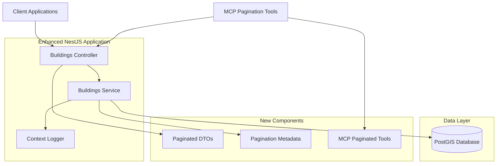

# Design Document

## Overview

The Buildings Pagination API extends the existing Data Enrich API with efficient pagination capabilities for building data retrieval. This enhancement implements limit/offset pagination with comprehensive metadata while preserving all existing filtering functionality including text-based searches and PostGIS spatial polygon queries.

The design follows Mindicity architecture patterns by extending the existing BuildingsService with paginated methods, adding new DTOs for pagination parameters and responses, and implementing corresponding MCP tools for AI agent integration. The solution optimizes database performance for large result sets while maintaining consistency with existing API patterns.

## Architecture

### Technology Stack

- **Framework**: NestJS with Fastify adapter (existing)
- **Database**: PostgreSQL with PostGIS extension (existing)
- **Validation**: Zod schemas for pagination parameters and response validation
- **Logging**: Pino logger with ContextLoggerService (existing)
- **Testing**: Jest with fast-check for property-based testing
- **MCP Integration**: Extended MCP tools for paginated AI agent access

### System Components



### Request Flow

1. **HTTP Request**: Client sends GET request to `/buildings/paginated` with query and pagination parameters
2. **Validation**: Zod schemas validate both filter parameters and pagination parameters (limit, offset)
3. **Service Layer**: Controller delegates to BuildingsService.findAllPaginated() with interface objects
4. **Count Query**: Service executes count query to determine total matching records
5. **Data Query**: Service executes paginated data query with LIMIT and OFFSET
6. **Metadata Calculation**: Service calculates hasNext/hasPrevious flags based on total and pagination parameters
7. **Response Formatting**: Service returns paginated data with metadata, controller converts to response DTOs
8. **MCP Integration**: MCP tools provide same paginated functionality for AI agents

## Components and Interfaces

### Controller Layer Extensions

**BuildingsController (Enhanced)**
- Adds new `findAllPaginated()` method for paginated endpoint
- Uses new pagination DTOs for request validation and response formatting
- Maintains existing `findAll()` method for backward compatibility
- Implements consistent error handling between paginated and non-paginated endpoints

**New Methods:**
- `findAllPaginated(query: QueryBuildingsPaginatedDto): Promise<BuildingsPaginatedResponseDto>`

### Service Layer Extensions

**BuildingsService (Enhanced)**
- Adds new `findAllPaginated()` method for paginated business logic
- Implements efficient count and data queries with shared WHERE conditions
- Calculates pagination metadata (hasNext, hasPrevious) based on total and parameters
- Optimizes database queries to minimize performance impact of large offsets

**New Methods:**
- `findAllPaginated(query: BuildingsPaginatedQuery): Promise<BuildingsPaginatedResponse>`
- `buildCountQuery(filters: BuildingsQuery): { query: string, params: any[] }`
- `calculatePaginationMeta(total: number, limit: number, offset: number): PaginationMeta`

### MCP Integration Extensions

**BuildingsMcpHttpTool (Enhanced)**
- Adds new paginated MCP tools for AI agent access
- Implements parameter validation for pagination parameters
- Provides comprehensive tool descriptions explaining pagination behavior
- Maintains consistent error handling with HTTP endpoints

**New Tools:**
- `search_buildings_basic_paginated`: Text-based filtering with pagination
- `search_buildings_spatial_paginated`: Spatial polygon filtering with pagination

## Data Models

### Enhanced DTOs (Controller Layer)

**QueryBuildingsPaginatedDto**
```typescript
{
  // Existing filter parameters
  cadastral_code?: string;
  municipality_code?: string;
  name?: string;
  building_type?: string;
  address?: string;
  polygon?: string; // WKT format
  
  // New pagination parameters
  limit?: number; // Default: 20, Max: 100
  offset?: number; // Default: 0
}
```

**BuildingsPaginatedResponseDto**
```typescript
{
  data: BuildingResponseDto[]; // Array of building objects
  meta: {
    total: number;        // Total matching records
    limit: number;        // Records per page
    offset: number;       // Starting position
    hasNext: boolean;     // More records available
    hasPrevious: boolean; // Previous records available
  };
}
```

### Enhanced Interfaces (Service Layer)

**BuildingsPaginatedQuery**
```typescript
{
  // Existing filter parameters
  cadastral_code?: string;
  municipality_code?: string;
  name?: string;
  building_type?: string;
  address?: string;
  polygon?: string;
  
  // New pagination parameters
  limit: number;
  offset: number;
}
```

**BuildingsPaginatedResponse**
```typescript
{
  data: BuildingData[];
  meta: PaginationMeta;
}
```

**PaginationMeta**
```typescript
{
  total: number;
  limit: number;
  offset: number;
  hasNext: boolean;
  hasPrevious: boolean;
}
```

### Database Query Strategy

The pagination implementation uses a two-query approach for optimal performance:

**Count Query:**
```sql
SELECT COUNT(*) as total
FROM public.buildings 
WHERE visible = true 
  AND [filter_conditions]
```

**Data Query:**
```sql
SELECT 
  id, cadastral_code, municipality_code, name, building_type, address,
  ST_AsGeoJSON(geom) as geometry,
  basic_data, visible, created_at, updated_at, updated_by
FROM public.buildings 
WHERE visible = true 
  AND [filter_conditions]
ORDER BY created_at DESC
LIMIT $limit OFFSET $offset
```

**Query Optimization:**
- Shared WHERE condition construction between count and data queries
- Proper indexing on filtered columns for performance
- LIMIT/OFFSET applied after filtering for accurate pagination
- Consistent ordering to ensure stable pagination results

### Pagination Metadata Calculation

**hasNext Calculation:**
```typescript
hasNext = offset + limit < total
```

**hasPrevious Calculation:**
```typescript
hasPrevious = offset > 0
```

**Edge Case Handling:**
- When offset exceeds total: return empty data array with accurate metadata
- When limit is 0: return empty data array with total count
- When no records match filters: return empty data array with total = 0

## Correctness Properties

*A property is a characteristic or behavior that should hold true across all valid executions of a system-essentially, a formal statement about what the system should do. Properties serve as the bridge between human-readable specifications and machine-verifiable correctness guarantees.*

### Property 1: Pagination Response Structure
*For any* paginated API request, the response should contain a data array and a meta object with total, limit, offset, hasNext, and hasPrevious fields
**Validates: Requirements 1.2, 1.5, 4.1**

### Property 2: Parameter Validation and Defaults
*For any* paginated request, limit should default to 20 and be capped at 100, offset should default to 0, and invalid parameters should be rejected with appropriate error messages
**Validates: Requirements 1.3, 1.4**

### Property 3: Filter Compatibility with Pagination
*For any* combination of text filters, spatial filters, and pagination parameters, all filters should be applied before pagination and the results should match the same filters applied to the non-paginated endpoint
**Validates: Requirements 2.1, 2.2, 2.3, 2.4**

### Property 4: Accurate Metadata Calculation
*For any* paginated request with filters, the total count in metadata should reflect the number of records matching the filters, not the total table size or paginated result size
**Validates: Requirements 2.5, 3.1, 3.4**

### Property 5: Navigation Flag Calculation
*For any* paginated response, hasNext should be true when offset + limit < total, and hasPrevious should be true when offset > 0
**Validates: Requirements 3.2, 3.3**

### Property 6: Response Format Consistency
*For any* building record returned in paginated responses, it should contain the same fields and formatting (including GeoJSON geometry) as the non-paginated endpoint, and error responses should follow the same format patterns
**Validates: Requirements 4.2, 4.3, 4.5, 6.5**

### Property 7: Empty Result Handling
*For any* query that matches no records, the response should return an empty data array with accurate metadata (total = 0, hasNext = false, hasPrevious based on offset)
**Validates: Requirements 4.4**

### Property 8: MCP Tool Pagination Support
*For any* MCP tool call with valid pagination parameters, the response should be properly formatted JSON with the same pagination structure and data format as HTTP endpoints
**Validates: Requirements 5.3, 5.4**

## Error Handling

### Pagination Parameter Validation

**Limit Parameter Validation:**
- Values below 1 return HTTP 400 with descriptive message
- Values above 100 return HTTP 400 with maximum limit guidance
- Non-numeric values return HTTP 400 with type validation error
- Missing limit parameter defaults to 20

**Offset Parameter Validation:**
- Negative values return HTTP 400 with descriptive message
- Non-numeric values return HTTP 400 with type validation error
- Missing offset parameter defaults to 0
- Offset exceeding total records returns empty data array with accurate metadata

### Filter Integration Errors

**Combined Filter Validation:**
- Invalid filters combined with valid pagination parameters return appropriate filter validation errors
- Pagination parameters are validated independently of filter parameters
- Spatial filter errors (invalid WKT) take precedence over pagination parameter errors

### Database Query Errors

**Count Query Failures:**
- Database connection issues during count query return HTTP 503 Service Unavailable
- Spatial query errors in count query return HTTP 500 with sanitized messages
- Timeout errors during count operations handled gracefully

**Data Query Failures:**
- Large offset performance issues handled with query optimization
- Database connection failures during data retrieval return HTTP 503
- Spatial index failures in paginated queries logged and reported

### MCP Pagination Error Handling

**Parameter Validation in MCP Tools:**
- Invalid pagination parameters in MCP calls return structured error responses
- Parameter type mismatches provide clear guidance for AI agents
- Missing pagination parameters use same defaults as HTTP endpoints

**Service Integration Errors:**
- MCP tool failures delegate error handling to underlying paginated service methods
- Maintains consistent error format between HTTP and MCP interfaces
- Preserves error context for debugging pagination issues

## Testing Strategy

### Dual Testing Approach

The pagination API implements both unit testing and property-based testing for comprehensive coverage:

**Unit Tests:**
- Verify specific pagination scenarios and edge cases
- Test integration between pagination and existing filter functionality
- Validate error conditions and boundary cases for pagination parameters
- Focus on concrete pagination scenarios with known datasets

**Property-Based Tests:**
- Verify universal pagination properties across all input combinations
- Use randomized pagination parameters and filter combinations
- Test pagination invariants and behavioral properties
- Minimum 100 iterations per property test

### Property-Based Testing Configuration

**Testing Framework:** Jest with fast-check library for property-based testing

**Test Configuration:**
- Minimum 100 iterations per property test
- Each property test references its design document property
- Tag format: **Feature: buildings-pagination, Property {number}: {property_text}**

**Property Test Implementation:**
- Property 1: Generate random pagination requests, verify response structure contains data and meta
- Property 2: Generate various limit/offset values, verify defaults and validation constraints
- Property 3: Generate filter combinations with pagination, verify filter application before pagination
- Property 4: Generate filtered requests, verify total count reflects filtered results not table size
- Property 5: Generate pagination scenarios, verify hasNext/hasPrevious calculation logic
- Property 6: Generate paginated and non-paginated requests, verify response format consistency
- Property 7: Generate queries matching no records, verify empty result handling
- Property 8: Generate MCP pagination calls, verify JSON response format and structure

### Unit Testing Focus Areas

**Controller Layer:**
- Pagination DTO validation and transformation
- HTTP status code handling for pagination errors
- Response formatting for paginated data and metadata

**Service Layer:**
- Count query construction and execution
- Data query construction with LIMIT/OFFSET
- Pagination metadata calculation logic
- Integration with existing filter functionality

**MCP Integration:**
- Paginated tool registration and discovery
- Parameter validation for pagination in MCP tools
- Response formatting consistency between HTTP and MCP

### Integration Testing

**Database Integration:**
- Count and data query performance with large datasets
- Pagination with spatial queries and PostGIS functions
- Transaction handling for count and data queries

**End-to-End Testing:**
- Complete paginated request/response cycles
- MCP paginated tool functionality
- Error propagation through pagination layers

**Performance Testing:**
- Large offset handling and query optimization
- Concurrent paginated request handling
- Memory usage with large paginated result sets