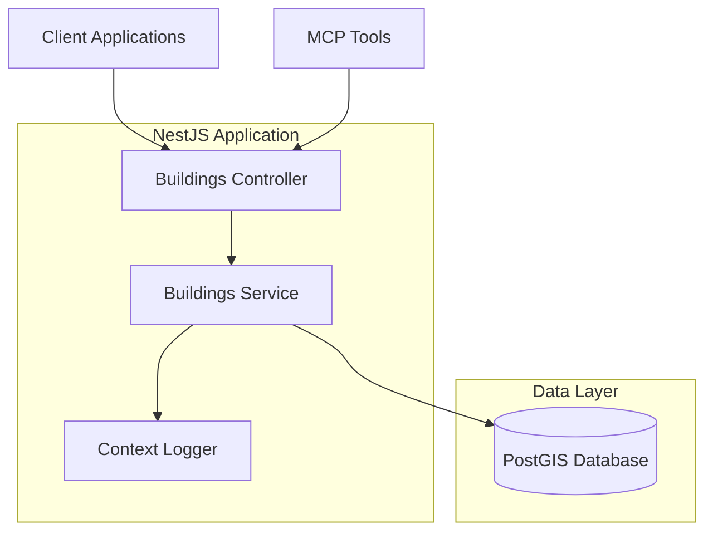

# Design Document

## Overview

The Data Enrichment API is a NestJS-based microservice that provides geospatial building data retrieval capabilities. The API follows Mindicity architecture patterns and integrates with PostGIS for spatial operations. It exposes RESTful endpoints for querying building data with both text-based filtering and geospatial polygon searches, along with MCP tools for AI agent integration.

The system is designed to handle high-volume queries efficiently while maintaining data integrity and providing comprehensive error handling for spatial operations.

## Architecture

### Technology Stack

- **Framework**: NestJS with Fastify adapter
- **Database**: PostgreSQL with PostGIS extension
- **Validation**: Zod schemas for request/response validation
- **Logging**: Pino logger with ContextLoggerService
- **Testing**: Jest for unit and integration testing
- **MCP Integration**: Model Context Protocol for AI agent connectivity

### System Components



### Request Flow

1. **HTTP Request**: Client sends GET request to `/buildings/list` with query parameters
2. **Validation**: Zod schemas validate query parameters and convert to DTOs
3. **Service Layer**: Controller delegates to BuildingsService with interface objects
4. **Database Query**: Service constructs PostGIS queries using SqlQueryBuilder or raw SQL
5. **Spatial Processing**: PostGIS performs spatial operations (ST_Intersects, ST_AsGeoJSON)
6. **Response Formatting**: Service returns data, controller converts to response DTOs
7. **MCP Integration**: MCP tools provide same functionality for AI agents

## Components and Interfaces

### Controller Layer

**BuildingsController**
- Handles HTTP requests and responses
- Uses DTOs for request validation and response formatting
- Delegates business logic to BuildingsService
- Implements proper error handling and logging

**Key Methods:**
- `findAll(query: QueryBuildingsDto): Promise<BuildingResponseDto[]>`

### Service Layer

**BuildingsService**
- Contains business logic for building data retrieval
- Uses interfaces for internal data handling
- Integrates with DatabaseService for PostGIS operations
- Implements spatial query construction and execution

**Key Methods:**
- `findAll(query: BuildingsQuery): Promise<BuildingData[]>`
- `validateWktPolygon(wkt: string): Promise<boolean>`
- `buildSpatialQuery(filters: BuildingsQuery): { query: string, params: any[] }`

### MCP Integration

**BuildingsMcpHttpTool**
- Provides AI agent access to building search functionality
- Implements two primary tools:
  - `search_buildings_basic`: Text-based filtering
  - `search_buildings_spatial`: Geospatial polygon filtering
- Delegates to BuildingsService for actual data retrieval

## Data Models

### Database Schema

The API interacts with the `public.buildings` table:

```sql
CREATE TABLE public.buildings (
    id VARCHAR NOT NULL,
    cadastral_code TEXT NOT NULL,
    municipality_code TEXT NOT NULL,
    name TEXT NULL,
    building_type TEXT NOT NULL,
    address TEXT NOT NULL,
    geom public.geometry(POINT, 4326) NULL,
    basic_data JSONB DEFAULT '{}'::jsonb NOT NULL,
    visible BOOLEAN DEFAULT true NULL,
    created_at TIMESTAMP DEFAULT now() NOT NULL,
    updated_at TIMESTAMP DEFAULT now() NULL,
    updated_by TEXT NULL
);
```

### DTOs (Controller Layer)

**QueryBuildingsDto**
```typescript
{
  cadastral_code?: string;
  municipality_code?: string;
  name?: string;
  building_type?: string;
  address?: string;
  polygon?: string; // WKT format
}
```

**BuildingResponseDto**
```typescript
{
  id: string;
  cadastral_code: string;
  municipality_code: string;
  name?: string;
  building_type: string;
  address: string;
  geometry?: object; // GeoJSON format
  basic_data: object;
  visible: boolean;
  created_at: string;
  updated_at?: string;
  updated_by?: string;
}
```

### Interfaces (Service Layer)

**BuildingsQuery**
```typescript
{
  cadastral_code?: string;
  municipality_code?: string;
  name?: string;
  building_type?: string;
  address?: string;
  polygon?: string;
}
```

**BuildingData**
```typescript
{
  id: string;
  cadastral_code: string;
  municipality_code: string;
  name?: string;
  building_type: string;
  address: string;
  geometry?: object;
  basic_data: object;
  visible: boolean;
  created_at: Date;
  updated_at?: Date;
  updated_by?: string;
}
```

### Spatial Query Construction

The service implements sophisticated spatial query building:

**Text Filtering:**
- Uses ILIKE for case-insensitive partial matching on `name` and `address`
- Uses exact matching for `cadastral_code`, `municipality_code`, and `building_type`
- Combines multiple filters with AND logic

**Spatial Filtering:**
- Validates WKT polygon using `ST_GeomFromText()`
- Uses `ST_Intersects()` for spatial intersection queries
- Converts geometry to GeoJSON using `ST_AsGeoJSON()`
- Handles SRID 4326 coordinate system

**Example Spatial Query:**
```sql
SELECT 
  id, cadastral_code, municipality_code, name, building_type, address,
  ST_AsGeoJSON(geom) as geometry,
  basic_data, visible, created_at, updated_at, updated_by
FROM public.buildings 
WHERE visible = true 
  AND name ILIKE '%search%'
  AND ST_Intersects(geom, ST_GeomFromText('POLYGON((...))', 4326))
ORDER BY created_at DESC;
```

## Correctness Properties

*A property is a characteristic or behavior that should hold true across all valid executions of a system-essentially, a formal statement about what the system should do. Properties serve as the bridge between human-readable specifications and machine-verifiable correctness guarantees.*

### Property 1: Complete Field Response
*For any* building record returned by the API, the response should contain all required fields: id, cadastral_code, municipality_code, name, building_type, address, geometry, basic_data, visible, created_at, updated_at, and updated_by
**Validates: Requirements 1.2, 1.3**

### Property 2: GeoJSON Geometry Format
*For any* building record with geometry data, the geometry field should be formatted as valid GeoJSON rather than PostGIS internal format
**Validates: Requirements 1.4, 6.2**

### Property 3: Visible Buildings Filter
*For any* API query without explicit visibility override, all returned buildings should have visible=true
**Validates: Requirements 1.5**

### Property 4: Exact Field Matching
*For any* exact match filter (cadastral_code, municipality_code, building_type), all returned buildings should have field values that exactly match the provided filter value
**Validates: Requirements 2.1, 2.2, 2.4**

### Property 5: Partial Text Matching
*For any* partial text filter (name, address), all returned buildings should contain the filter text within the specified field, case-insensitive
**Validates: Requirements 2.3, 2.5, 2.7**

### Property 6: Multiple Filter Combination
*For any* query with multiple filters, all returned buildings should satisfy every provided filter criterion simultaneously
**Validates: Requirements 2.6, 3.5**

### Property 7: Spatial Intersection
*For any* valid WKT polygon filter, all returned buildings should have geometry that spatially intersects with the provided polygon
**Validates: Requirements 3.1**

### Property 8: Error Handling for Invalid Input
*For any* invalid input (malformed WKT, invalid parameters), the API should return descriptive error messages rather than crashing or returning incorrect data
**Validates: Requirements 3.2, 4.5**

### Property 9: MCP JSON Response Format
*For any* MCP tool call with valid parameters, the response should be properly formatted JSON containing building data
**Validates: Requirements 4.3**

<function_calls>
<invoke name="prework">
<parameter name="featureName">data-enrich

## Error Handling

### Input Validation Errors

**WKT Polygon Validation:**
- Invalid WKT format returns HTTP 400 with descriptive message
- Uses PostGIS `ST_GeomFromText()` for validation
- Provides specific error details about WKT parsing failures

**Query Parameter Validation:**
- Zod schemas validate all query parameters
- Type mismatches return HTTP 400 with field-specific errors
- Empty or null values handled gracefully

### Database Errors

**Connection Failures:**
- Database connection issues return HTTP 503 Service Unavailable
- Implements retry logic with exponential backoff
- Logs connection errors with correlation IDs

**Spatial Query Errors:**
- PostGIS function errors return HTTP 500 with sanitized messages
- Spatial index failures handled gracefully
- Invalid geometry operations logged and reported

### MCP Error Handling

**Tool Parameter Validation:**
- Invalid MCP parameters return structured error responses
- Parameter type mismatches provide clear guidance
- Missing required parameters identified specifically

**Service Integration Errors:**
- MCP tool failures delegate error handling to underlying service
- Maintains consistent error format across HTTP and MCP interfaces
- Preserves error context for debugging

## Testing Strategy

### Dual Testing Approach

The API implements both unit testing and property-based testing for comprehensive coverage:

**Unit Tests:**
- Verify specific examples and edge cases
- Test integration points between components
- Validate error conditions and boundary cases
- Focus on concrete scenarios and known inputs

**Property-Based Tests:**
- Verify universal properties across all inputs
- Use randomized input generation for comprehensive coverage
- Test invariants and behavioral properties
- Minimum 100 iterations per property test

### Property-Based Testing Configuration

**Testing Framework:** Jest with fast-check library for property-based testing

**Test Configuration:**
- Minimum 100 iterations per property test
- Each property test references its design document property
- Tag format: **Feature: data-enrich, Property {number}: {property_text}**

**Property Test Implementation:**
- Property 1: Generate random building data, verify all required fields present
- Property 2: Generate buildings with geometry, verify GeoJSON format
- Property 3: Generate queries, verify all results have visible=true
- Property 4: Generate exact filters, verify exact matching behavior
- Property 5: Generate text filters, verify case-insensitive partial matching
- Property 6: Generate multiple filters, verify AND logic
- Property 7: Generate polygons and buildings, verify spatial intersection
- Property 8: Generate invalid inputs, verify error responses
- Property 9: Generate MCP calls, verify JSON response format

### Unit Testing Focus Areas

**Controller Layer:**
- DTO validation and transformation
- HTTP status code handling
- Error response formatting

**Service Layer:**
- Database query construction
- Spatial operation integration
- Business logic validation

**MCP Integration:**
- Tool registration and discovery
- Parameter validation and transformation
- Response formatting consistency

### Integration Testing

**Database Integration:**
- PostGIS function integration
- Spatial index utilization
- Transaction handling

**End-to-End Testing:**
- Complete request/response cycles
- MCP tool functionality
- Error propagation through layers

**Performance Testing:**
- Spatial query performance with large datasets
- Concurrent request handling
- Memory usage with complex polygons